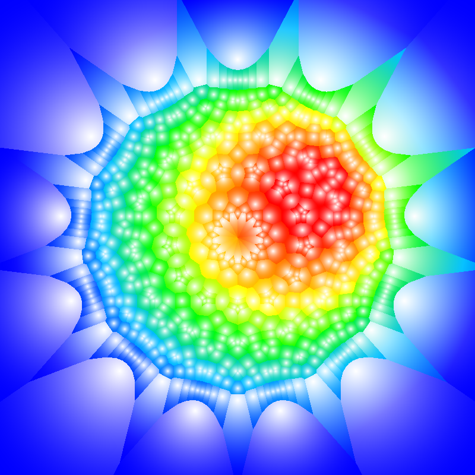

# StarryMosaic

A library for generating colorful mosaic images with various geometrical patterns.

## How to create mosaic image

To create mosaic simply:

 - set size of resulting image;
 - choose shape which mosaic is based on,
 - set its position, rotation and scale
 - and finally build selected type of mosaic.

Then this mosaic can be painted with any color or gradient.

## Example

Next code creates logo of this project (the one you can see above).

```rust
use palette::{Gradient, LinSrgb};
use starry_mosaic::{coloring_method::RadialGradient, Mosaic, MosaicBuilder, Vector};

let mosaic = MosaicBuilder::default()
    .set_regular_polygon_shape(13)
    .set_image_size(800, 800)
    .set_center(Vector::new(400.0, 400.0))
    .set_scale(0.75)
    .build_star()
    .unwrap();

let gradient = vec![
    (0.125, LinSrgb::new(1.0f64, 0.0, 0.0)),
    (0.275, LinSrgb::new(1.0f64, 0.5, 0.0)),
    (0.425, LinSrgb::new(1.0f64, 1.0, 0.0)),
    (0.575, LinSrgb::new(0.0f64, 1.0, 0.0)),
    (0.725, LinSrgb::new(0.0f64, 0.75, 1.0)),
    (0.875, LinSrgb::new(0.0f64, 0.0, 1.0)),
];
let mosaic_image = mosaic.draw(RadialGradient::new(
    gradient,
    Vector::new(540.0, 320.0),
    20.0,
    Vector::new(400.0, 400.0),
    360.0,
    0.25
));

let save_result = mosaic_image.save("target/logo.png");
assert!(save_result.is_ok());
```
