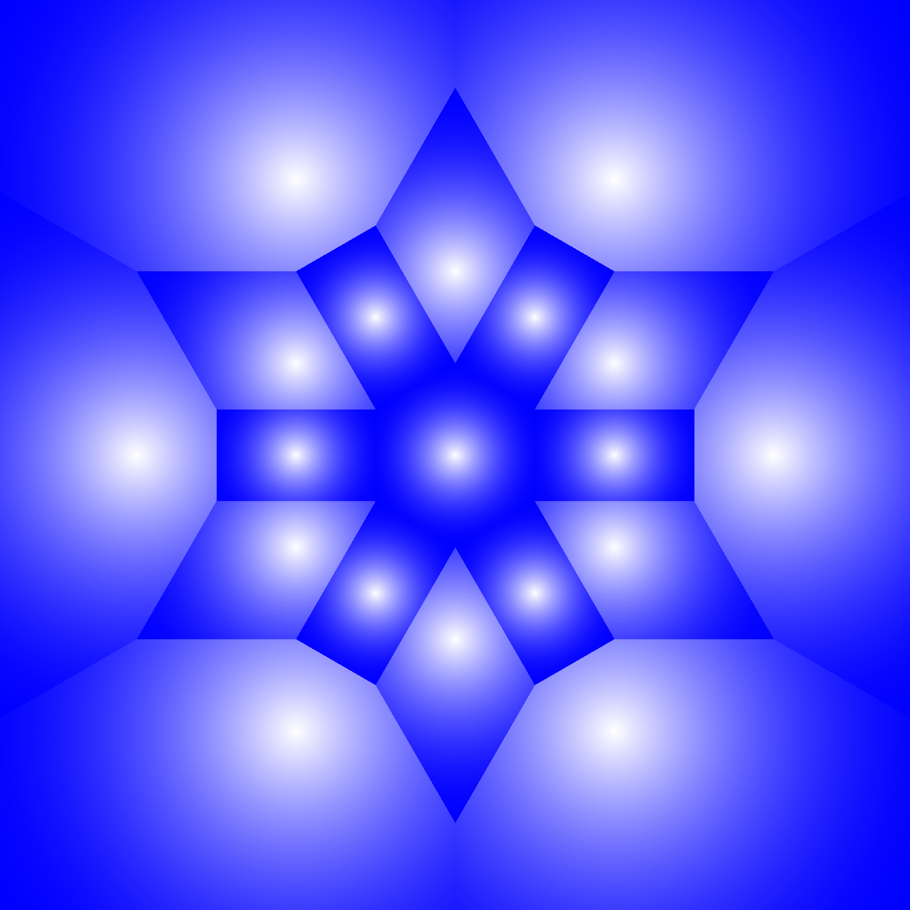
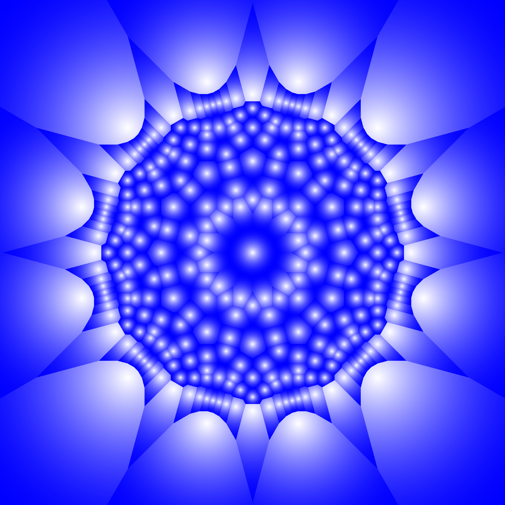
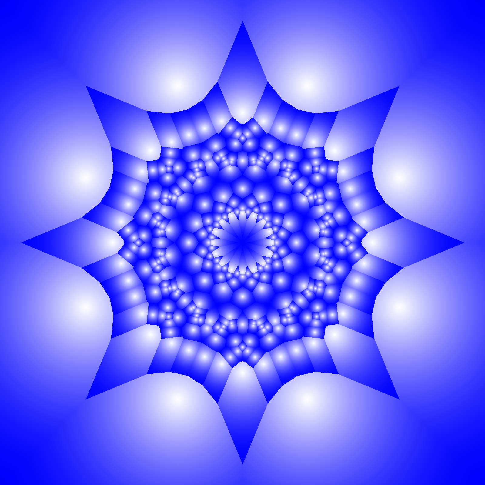
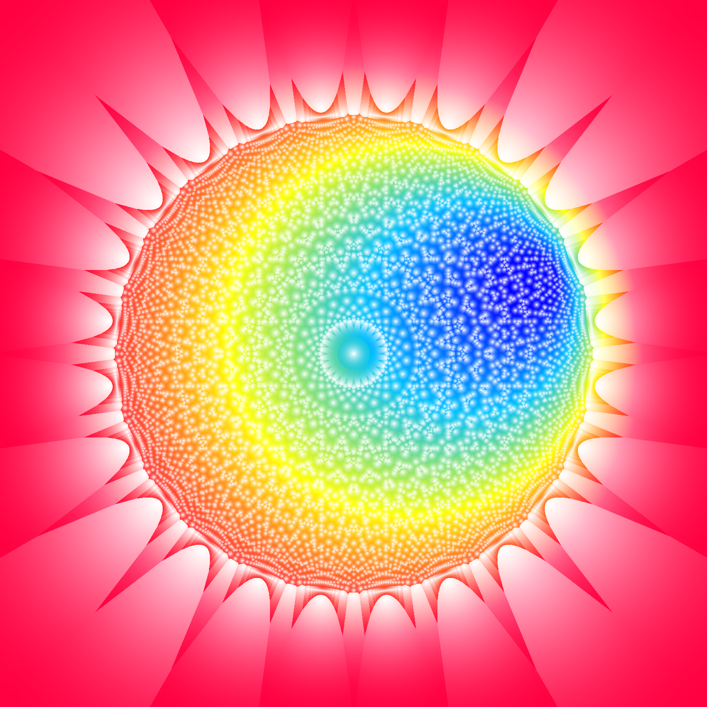

# Starry Mosaic images

All images in this directory (and subdirectories) are created using `starry_mosaic::StarryMosaic` and
based on [Voronoi diagram](https://en.wikipedia.org/wiki/Voronoi_diagram).

Every mosaic image can be generated using different mosaic shapes (`starry_mosaic::mosaic_shape::MosaicShape`)
and painted with various coloring methods (`starry_mosaic::coloring_method::ColoringMethod`).

## Single colored

Mosaics are painted with single color to create images below.
This library supports many color types provided by `palette` crate.

*Why images are blue? Just because I like this color!*

### With shape of regular polygon

Mosaic shape used to generate images in this section is based on regular polygon.
See `starry_mosaic::mosaic_shape::RegularPolygon` for more details.

### With shape of polygonal star

Shape of mosaic used to generate images in this section is based on polygonal star.
See `starry_mosaic::mosaic_shape::PolygonalStar` for more details.

## Linear gradient

Mosaics are painted with linear gradient (`starry_mosaic::coloring_method::LinearGradient`)
to create images below.

### With shape of regular polygon

Mosaic shape used to generate images in this section is based on regular polygon.
See `starry_mosaic::mosaic_shape::RegularPolygon` for more details.

### With shape of polygonal star

Shape of mosaic used to generate images in this section is based on polygonal star.
See `starry_mosaic::mosaic_shape::PolygonalStar` for more details.

## Radial gradient

Mosaics are painted with radial gradient (`starry_mosaic::coloring_method::RadialGradient`)
to create images below.

### With shape of regular polygon

Mosaic shape used to generate images in this section is based on regular polygon.
See `starry_mosaic::mosaic_shape::RegularPolygon` for more details.

### With shape of polygonal star

Shape of mosaic used to generate images in this section is based on polygonal star.
See `starry_mosaic::mosaic_shape::PolygonalStar` for more details.

## Conic gradient

Mosaics are painted with conic gradient (`starry_mosaic::coloring_method::ConicGradient`)
to create images below.

### With shape of regular polygon

Mosaic shape used to generate images in this section is based on regular polygon.
See `starry_mosaic::mosaic_shape::RegularPolygon` for more details.

### With shape of polygonal star

Shape of mosaic used to generate images in this section is based on polygonal star.
See `starry_mosaic::mosaic_shape::PolygonalStar` for more details.

